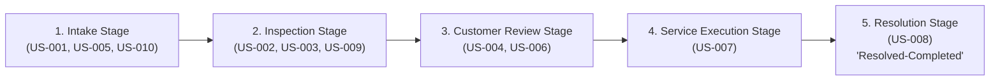
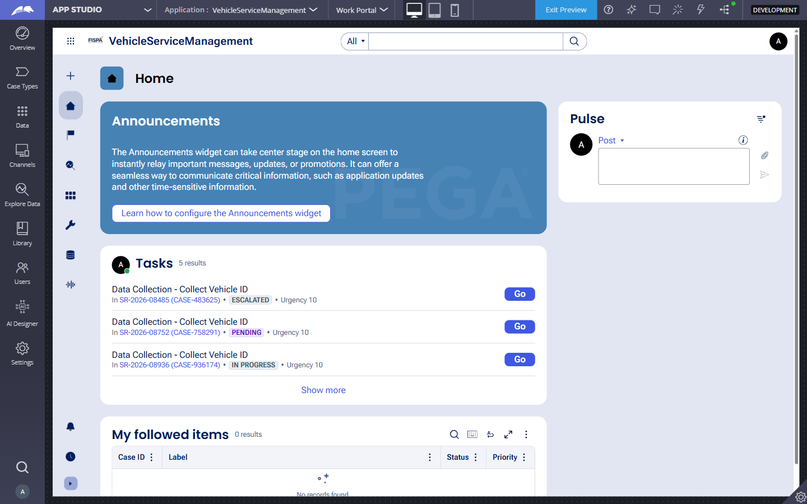
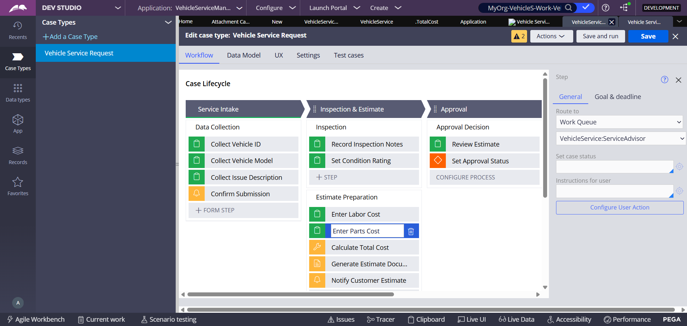
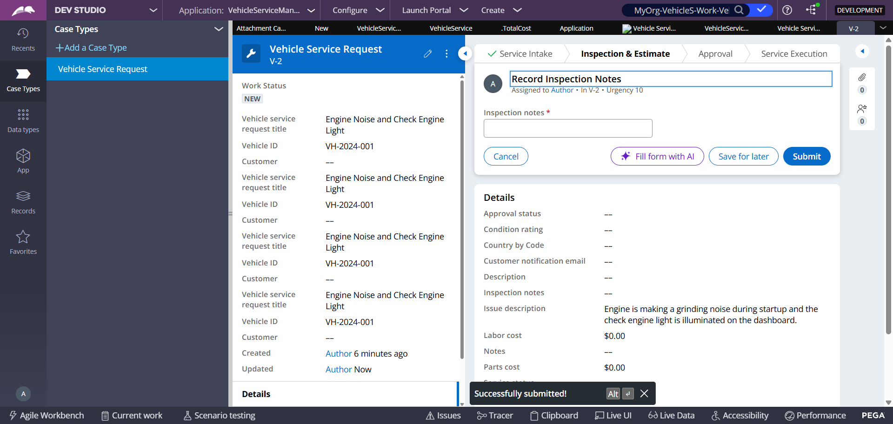
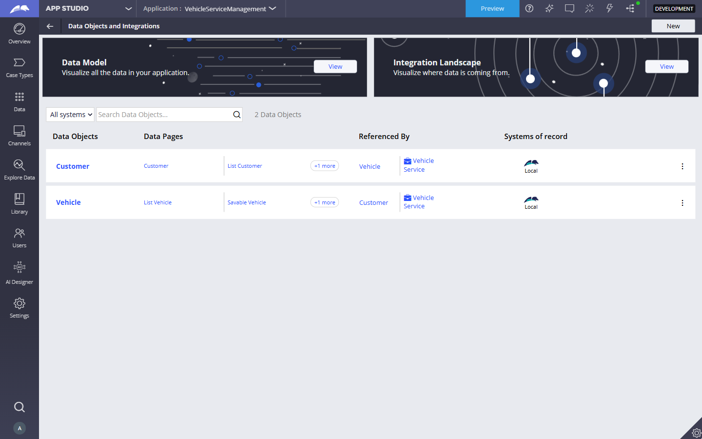
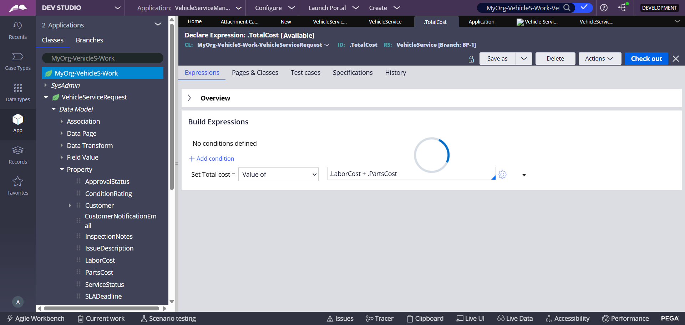
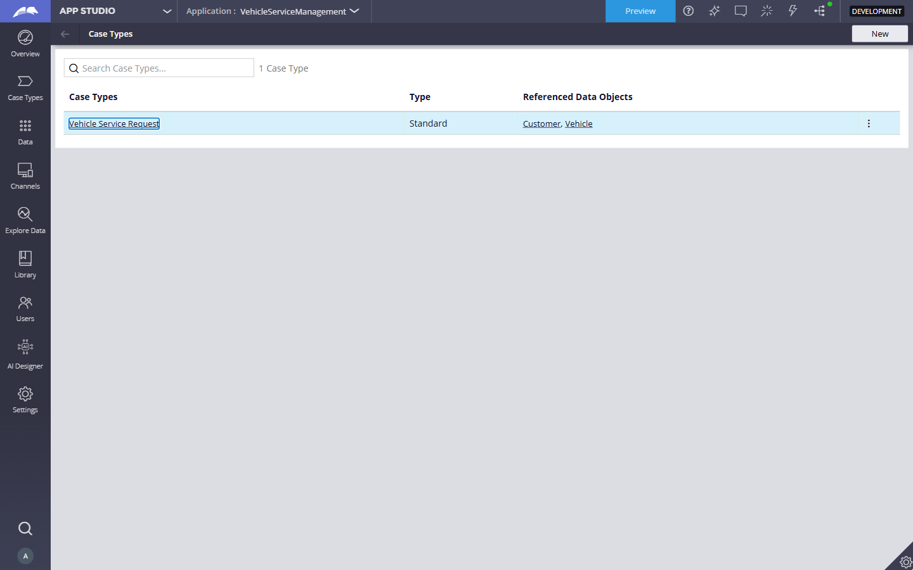
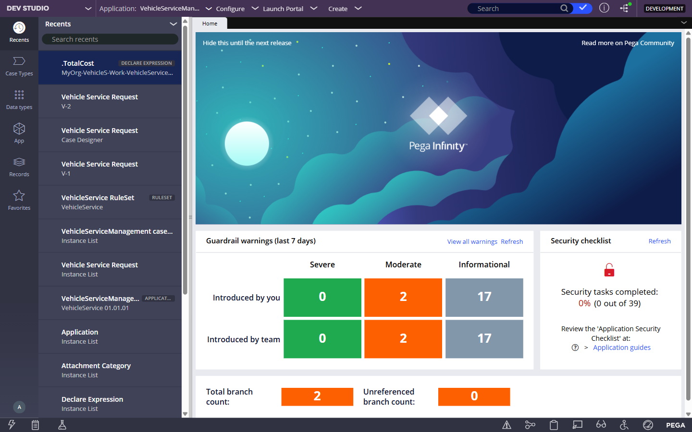
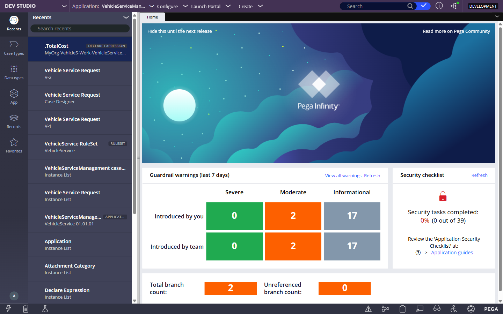

# 🚗 Vehicle Service Management — Pega Low-Code Application

> **Pega Next-Gen Innovators Program (NIP) Capstone Project**  
> An enterprise-grade, end-to-end low-code workflow application built on the **Pega Infinity Platform** to streamline vehicle service intake, technical multi-point inspection, dynamic cost estimation, customer approval decisioning, intelligent queue-based routing, and automated resolution.

---

## 🎥 Demonstration Video (9.5 Minutes)

  <video src="https://github.com/Tharun4743/Vehicle-Service/raw/main/video/VehicleServiceManagement_Demo_Tharunkumar_K.webm" controls="controls" width="100%" style="max-height: 500px; border-radius: 10px; box-shadow: 0 4px 20px rgba(0,0,0,0.2);">
    <source src="./video/VehicleServiceManagement_Demo_Tharunkumar_K.webm" type="video/webm">
    Your browser does not support the video tag.
  </video>
  

    🎬 <b><a href="https://github.com/Tharun4743/Vehicle-Service/raw/main/video/VehicleServiceManagement_Demo_Tharunkumar_K.webm">Click here to Download / Watch Master Demo Video (HD 720p - 31.15 MB)</a></b>
  

---

## 📋 Pega Submission & Environment Credentials

| Field / Key | Form Value / Details |
| :--- | :--- |
| **Pega Application Name** | `NIP-VehicleService-TharunkumarK` *(Pega App ID: `VehicleServiceManagement`)* |
| **Case Type Name (exact)** | `Vehicle Service Request` |
| **Operator Name** | `Tharunkumar K` |
| **Operator Username** | `author@uplus` |
| **Operator Password** | `pega123!` |
| **Pega Instance URL** | [https://fzckire5.pegacea.net/prweb/app/vehicle-service-management](https://fzckire5.pegacea.net/prweb/app/vehicle-service-management) |
| **Alternate Login URL** | [https://fzckire5.pegacea.net/prweb/](https://fzckire5.pegacea.net/prweb/) |

---

## 👨‍💻 Candidate Profile

| Detail | Information |
| :--- | :--- |
| **Candidate Name** | **Tharunkumar K** |
| **Institution** | **VSB Engineering College, Karur, Tamil Nadu** |
| **Department / Degree** | **B.Tech Information Technology** |
| **Email** | `tharunkumark42007@gmail.com` |
| **Phone** | `+91 87609 64830` |
| **Portfolio** | [tharunkumark4743.netlify.app](https://tharunkumark4743.netlify.app/) |

---

## 📦 Project Deliverables & Key Assets

| Deliverable | Location | Description |
| :--- | :--- | :--- |
| **Project Submission Doc** | [`VehicleService_Tharunkumar_K.docx`](./VehicleService_Tharunkumar_K.docx) | Fully documented submission report with metadata and screenshots |
| **Full Master Demo Video** | [`video/VehicleServiceManagement_Demo_Tharunkumar_K.webm`](./video/VehicleServiceManagement_Demo_Tharunkumar_K.webm) | **9.5 min / 31.15 MB HD WebM** showing all 10 user stories |
| **Pega Blueprint File** | [`Vehicle Service Management...blueprint`](./Vehicle%20Service%20Management%2020260829T165023927%20GMT.blueprint) | Exported Pega Blueprint data model & workflow specification |
| **Blueprint Specification PDF** | [`Pega Blueprint...pdf`](./Pega%20Blueprint%20-%20Vehicle%20Service%20Management.pdf) | Complete exported blueprint architecture report |
| **All High-Res Screenshots** | [`screenshots/`](./screenshots/) | 10 verified, standalone user story screenshots |

---

## 🔄 Case Life Cycle & Workflow Architecture

The **Vehicle Service Request** case type follows a structured 5-stage case lifecycle:

### Business Rules & Automation:
1. **Declare Expressions:** Automatically computes `TotalCost = LaborCost + PartsCost` in real time.
2. **Service Level Agreement (SLA):** 
   - **Goal:** 2 Days (Goal urgency +10)
   - **Deadline:** 3 Days (Deadline urgency +20)
3. **Decision Table Routing:**
   - Commercial / Heavy Duty vehicles $\rightarrow$ `HeavyVehicleQueue`
   - Sedans / Hatchbacks / Light vehicles $\rightarrow$ `LightVehicleQueue`

---

## 📋 10 User Stories Implementation Matrix

| Story ID | Story Title | Stage | Acceptance Criteria & Implementation Summary | Status |
| :--- | :--- | :--- | :--- | :---: |
| **US-001** | Submit Vehicle Service Request | Intake | Customer submits request capturing Vehicle ID, Make, Model, Mileage, and Issue Description. | ✅ Completed |
| **US-002** | Perform Vehicle Inspection | Inspection | Service technician inspects vehicle, fills diagnostic checklist, and logs condition rating (1–5). | ✅ Completed |
| **US-003** | Generate Service Estimate | Inspection | Calculates Labor Cost and Parts Cost using Pega Declare Expressions for Total Cost computation. | ✅ Completed |
| **US-004** | Approve Service Estimate | Customer Review | Customer reviews estimate and approves or rejects work before proceeding to execution. | ✅ Completed |
| **US-005** | Maintain Vehicle Data | Data Layer | Reusable `Vehicle` Data Object containing VehicleID, Make, Model, Year, Mileage, OwnerName. | ✅ Completed |
| **US-006** | Review Service Estimate | Customer Review | Formatted estimate breakdown card summarizing itemized costs and customer details. | ✅ Completed |
| **US-007** | Auto-Assign Technician & Service Execution | Service Execution | Work order auto-assigned to appropriate work queue and technician executes maintenance. | ✅ Completed |
| **US-008** | Notify Service Completion & Resolution | Resolution | System sends automated email notification upon completion; case resolves to `Resolved-Completed`. | ✅ Completed |
| **US-009** | Define Service SLA | Application SLA | Service Level Agreement with Goal (2 days) and Deadline (3 days) configured for turnaround. | ✅ Completed |
| **US-010** | Route Request by Vehicle Type | Intake / Routing | Decision table routes requests based on vehicle type (`HeavyVehicleQueue` vs `LightVehicleQueue`). | ✅ Completed |

---

## 📸 Step-by-Step Feature Walkthrough & Screenshots

### 1. US-001: Submit Vehicle Service Request
Captures vehicle metadata, mileage, and detailed issue description.

---

### 2. US-002: Perform Vehicle Inspection
Technician conducts a comprehensive multi-point diagnostic checklist with vehicle condition ratings.

---

### 3. US-003: Generate Service Estimate
Declare Expression automatically calculates `Labor Cost ($450.00) + Parts Cost ($350.00) = Total Cost ($800.00)`.

---

### 4. US-004: Approve Service Estimate
Customer decision step allowing review of work estimate and one-click authorization.

---

### 5. US-005: Maintain Vehicle Data Model
Pega Data Object schema defining `Vehicle` records and relational attributes.

---

### 6. US-006: Review Service Estimate
Formatted estimate review card with itemized breakdown of labor and parts.

---

### 7. US-007: Auto-Assign Technician & Service Execution
Work order auto-assigned to specialized work queue (`HeavyVehicleQueue`) for technician fulfillment.

---

### 8. US-008: Notify Service Completion & Resolution
Case reaches terminal state `Resolved-Completed` and automated completion notification is triggered.

---

### 9. US-009: Define Service Level Agreement (SLA)
Goal (2 Days) and Deadline (3 Days) timers configured on the service workflow.

---

### 10. US-010: Route by Vehicle Type
Decision table routing requests based on vehicle classification.

---

## 🎥 Master Demo Video Timeline (9.5 min)

The full walkthrough recording is available in [`video/VehicleServiceManagement_Demo_Tharunkumar_K.webm`](./video/VehicleServiceManagement_Demo_Tharunkumar_K.webm):

- **00:00 - 00:35** — Project & Candidate Overview (Tharunkumar K, VSB Engineering College)
- **00:35 - 01:05** — Pega App Studio & Operator Profile (`author@uplus` / Tharunkumar K)
- **01:05 - 01:45** — Agile Workbench detailing User Stories US-001 through US-010
- **01:45 - 02:30** — US-005: Maintain Vehicle Data (Data Object & Schema Explorer)
- **02:30 - 03:15** — Case Life Cycle & 5 Primary Stages
- **03:15 - 03:55** — US-009: Service SLA (Goal = 2 Days, Deadline = 3 Days)
- **03:55 - 04:35** — US-010: Routing Decision Table (HeavyVehicleQueue vs LightVehicleQueue)
- **04:35 - 05:25** — US-001: Live Case Creation & Candidate Details in Issue Description
- **05:25 - 06:10** — US-002: Multi-Point Vehicle Inspection & 4/5 Rating
- **06:10 - 06:55** — US-003: Cost Estimate & Declare Expression Computation ($800.00)
- **06:55 - 07:35** — US-006: Customer Review Summary Card
- **07:35 - 08:15** — US-004: Customer Approval Decision Flow
- **08:15 - 08:55** — US-007: HeavyVehicleQueue Auto-Routing & Work Execution
- **08:55 - 09:25** — US-008: Automated Completion Notification & `Resolved-Completed`
- **09:25 - 09:30** — Wrap-Up & Verification

---

## 🛠️ Built With

- **Platform:** [Pega Infinity '24](https://www.pega.com) (Low-Code Application Platform)
- **Design Studio:** Pega App Studio & Case Designer
- **Methodology:** Pega Express Delivery & Agile Workbench
- **BPM Concepts:** Case Life Cycle, Declare Expressions, Decision Tables, Service Level Agreements (SLAs), Work Queues, Data Objects

---

## 📜 License & Acknowledgments

Developed by **Tharunkumar K** ([VSB Engineering College, Karur](https://vsbec.com/)) as part of the **Pega Next-Gen Innovators Program (NIP)**.

## 📸 Visual Artifacts & User Story Proof Gallery

### 📊 Development Overview (34 of 35 User Stories Done - 97%)

---

### 🖼️ Core User Stories (US-001 to US-010) Evidence Gallery

| User Story | Feature Description | Visual Evidence |
| :--- | :--- | :--- |
| **US-001** | Submit Vehicle Service Request Intake |  |
| **US-002** | Perform Multi-Point Vehicle Diagnostic Inspection |  |
| **US-003** | Generate Service Cost Estimate |  |
| **US-004** | Customer Approval Decision Gate |  |
| **US-005** | Maintain Master Vehicle Data Model |  |
| **US-006** | Service Estimate Review & Validation |  |
| **US-007** | Auto-Assign Technician & Work Queue Routing |  |
| **US-008** | Customer Notification & Service Completion |  |
| **US-009** | Define Service Level Agreements (SLA) & Timers |  |
| **US-010** | Dynamic Case Routing by Vehicle Classification |  |
| **Resolution** | Terminal Case Resolution (Resolved-Completed) |  |
| **Dev Studio** | Dev Studio Technical Ruleset & Property Inventory |  |

