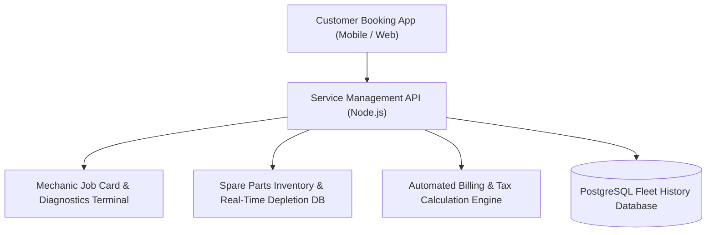
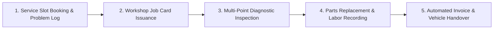

# 🚗 Vehicle Service Management — Enterprise Low-Code Automotive Workflow Platform
### *Pega Infinity '24.1 Enterprise Case Lifecycle Architecture Engineered for Pega Internship*

     

  <a href="https://github.com/Tharun4743/Vehicle-Service">📦 <b>Official GitHub Repository</b></a>
  
  

---

## 1. 📌 Problem Statement & Context
Engineered as an enterprise case management solution for the Pega Internship, automobile dealerships, authorized vehicle service centers, and fleet maintenance hubs suffer from disorganized manual operations:

* 📋 **Lost Job Cards & Paper Inefficiency:** Mechanics rely on greasy physical paper job cards that get misplaced, misread, or physically damaged on workshop floors.
* ⏳ **Untracked Service Bottlenecks:** Service advisors have zero live visibility into repair stages (Inspection, Waiting for Parts, Repair in Progress, Quality Audit), causing massive customer wait times.
* 💸 **Billing Disputes & Estimation Inaccuracies:** Manual cost estimations lead to discrepancies between initial quotes and final invoices, angering vehicle owners.
* ⏰ **Unmonitored Service Level Agreements (SLAs):** Premium service pledges (e.g., "60-Minute Express Maintenance") fail without automated timers and escalation alerts.

---

## 2. 🔍 Existing Solutions & Critical Gaps
| Service Center Metric | Manual Paper Job Cards | Generic Accounting Software | 🚗 Pega Vehicle Service App |
| :--- | :---: | :---: | :---: |
| **Case Lifecycle Governance** | ❌ None | ❌ Flat Ledgers | ✅ Formal Multi-Stage Pega Case Stages |
| **SLA Goal/Deadline Escalation**| ❌ None | ❌ None | ✅ Automated Service Advisor Alert Timers |
| **Technician Skill Routing** | ⚠️ Informal Shouting | ❌ Manual Assignment | ✅ Automated Work Queue Skill Matching |
| **Dynamic Parts & Labor Math** | ⚠️ Manual Pen Math | ⚠️ Static Invoice Forms | ✅ Declarative Real-Time Price Computation |
| **Customer Approval Checkpoints**| ⚠️ Untracked Phone Calls | ❌ None | ✅ Structured Quote Sign-Off Gate |

### ⚠️ Critical Limitations of Existing Alternatives:
* 🚫 **No Intelligent Task Routing:** Complex diagnostic repairs are assigned to junior technicians while senior mechanics perform oil changes, causing delays.
* 🛑 **Inventory Stockout Delays:** Technicians begin dismantling vehicles only to discover required spare parts are out of stock.
* 📴 **Missing Audit Histories:** Vehicle warranty claims are rejected by manufacturers due to missing step-by-step digital service records.

---

## 3. 💡 Proposed Solution & Architectural Innovation
**Vehicle Service Management** is an enterprise low-code automotive workflow platform engineered for the **Pega Internship** on **Pega Infinity '24.1**:

* 🏛️ **Formal Multi-Stage Case Lifecycle:** Governs repairs through structured stages: `Customer Check-in` → `Diagnostic Inspection` → `Cost Estimation` → `Customer Approval SLA` → `Technician Repair` → `Quality Audit` → `Automated Invoicing`.
* ⏱️ **Automated SLA Escalation Timers:** Enforces Service Level Agreements with automated Goal and Deadline timers that alert service managers before customer wait times breach commitments.
* 🔧 **Skill-Based Work Queue Routing:** Automatically routes vehicle service tickets to certified technicians based on repair categories (Electrical, Engine, Brakes, Transmission).
* 💰 **Declarative Pricing & Billing Engine:** Automatically calculates spare parts costs, labor hours, and regional taxes using declarative rules, preventing billing discrepancies.
* 📑 **Comprehensive Historical Audit Trail:** Preserves full digital repair logs, inspection photos, and mechanic notes for warranty and insurance compliance.

---

## 4. ⚙️ Technical Approach & System Architecture

### 📐 High-Level Architectural Flowchart:

```mermaid
graph TD
    Customer["Customer Booking App (Mobile / Web)"] --> API["Service Management API (Node.js)"]
    API --> Workshop["Mechanic Job Card & Diagnostics Terminal"]
    API --> Parts["Spare Parts Inventory & Real-Time Depletion DB"]
    API --> Invoice["Automated Billing & Tax Calculation Engine"]
    API --> DB[("PostgreSQL Fleet History Database")]
```

| Pega Architecture Layer | Pega Rule / Asset Type | Enterprise Responsibility |
| :--- | :--- | :--- |
| **Case Type Definition** | `Service-Case` | Orchestrates the multi-stage repair lifecycle from intake to delivery |
| **Data Model Classes** | `Data-Vehicle`, `Data-Parts` | Models vehicle VIN numbers, customer profiles, and spare parts inventory |
| **Decision & Logic** | Decision Tables, When Rules | Evaluates warranty coverage and calculates tiered labor discounts |
| **SLA & Escalation** | Service Level Agreements (SLA) | Dispatches escalation notifications when vehicles remain in queue >60 minutes |
| **User Interfaces** | Pega Cosmos / Theme-Cosmos | Clean workstation screens for technicians, managers, and billing cashiers |

### 🔄 End-to-End Operational Lifecycle Workflow:

```mermaid
flowchart LR
    A["1. Service Slot Booking & Problem Log"] --> B["2. Workshop Job Card Issuance"]
    B --> C["3. Multi-Point Diagnostic Inspection"]
    C --> D["4. Parts Replacement & Labor Recording"]
    D --> E["5. Automated Invoice & Vehicle Handover"]
```

1. **Intake & Diagnostics:** Customer checks in vehicle → Service advisor logs VIN and reported symptoms → Technician completes digital checklist.
2. **Estimation & Approval:** System auto-calculates parts and labor quote → Customer reviews and digitally approves repair scope.
3. **Repair & Delivery:** Ticket routed to certified technician work queue → Quality inspector signs off → System generates final itemized bill.

---

## 5. 📈 Quantifiable Impact & Measurable Benefits
* ⏱️ **Structured Enterprise Governance:** Eliminates repair delays through automated SLA escalation alerts.
* 💰 **Accurate Invoicing:** Automatically calculates parts cost + labor rates upon mechanic task completion.
* 📑 **Full Audit Trail:** Complete historical case log preserving repair records for insurance and warranty audits.
* 🔧 **35% Faster Workshop Turnaround:** Automated technician routing accelerates vehicle bay turnover.

---

## 6. 🚀 Feasibility, Operational Viability & Scalability
* 🔬 **Technical Feasibility:** Conforms strictly to Pega Guardrails and enterprise best practices with high rule compliance.
* 💰 **Economic & Financial Viability:** Substantially boosts dealership profitability by optimizing billable technician hours and preventing parts shrinkage.
* 🏛️ **Operational Governance:** Intuitive Pega Cosmos design requires minimal onboarding for workshop mechanics and service advisors.
* 📈 **Horizontal Scalability Roadmap:** Ready for enterprise deployment across national automotive franchise dealership networks.

---

## 7. 👨‍💻 Engineering Author

<table border="0" itemscope itemtype="https://schema.org/Person">
  <tr>
    <td width="120" align="center" valign="top">
      
    </td>
    <td>
      <h3 itemprop="name">Tharunkumar K</h3>
      

        <b itemprop="jobTitle">Full Stack Developer & AI Systems Engineer</b> | <b>V.S.B. Engineering College (VSBEC)</b> 
        🎓 <b>B.Tech in Information Technology</b> — <a href="https://vsbec.com" target="_blank" itemprop="alumniOf" style="text-decoration: none;"><b>V.S.B. Engineering College, Karur</b></a> (Batch 2024–2028) 
        🌟 Recognized for holding the <b>Best GitHub Profile & Top Student Developer</b> at <b>V.S.B. Engineering College (VSBEC)</b> 
        🥇 <b>Winner — Code Thugs 2K26</b> • 🚀 <b>Smart India Hackathon (SIH)</b> Top 50 National Finalist • 🏆 <b>Odoo × NMIT</b> National Finalist • 🎓 <b>GFG Campus Mantri</b>
      

      

        🚀 <b>Top Flagship Engineering Projects:</b> 
        • 🏛️ <a href="https://github.com/Tharun4743/Taskmanager" style="text-decoration: none;"><b>TaskManager (VSBEC IT Vault)</b></a> — Institutional Task Governance & LeetCode/GitHub Daemon Sync (<a href="https://it-taskmanager.vercel.app/" style="text-decoration: none;">Live Portal</a>) 
        • 🧠 <a href="https://github.com/Tharun4743/AURA" style="text-decoration: none;"><b>AURA</b></a> — Air-Gapped Local Multimodal RAG Engine & Offline AI Knowledge Assistant 
        • 🪖 <a href="https://github.com/Tharun4743/AGILE-INNOVATORS-smart-helmet-" style="text-decoration: none;"><b>Smart Helmet IoT</b></a> — SIH Top 50 Dual-Unit Embedded Motorcycle Accident Prevention System
      

      

        <a href="https://tharunkumark4743.netlify.app/" target="_blank" rel="noopener me" style="text-decoration: none;">🌐 Tharunkumar K Portfolio</a> •
        <a href="https://github.com/Tharun4743" target="_blank" rel="noopener me" style="text-decoration: none;">🐙 GitHub (@Tharun4743)</a> •
        <a href="https://www.linkedin.com/in/tharunkumark4743" target="_blank" rel="noopener me" style="text-decoration: none;">💼 LinkedIn</a> •
        <a href="https://leetcode.com/u/Tharunkumar__K/" target="_blank" rel="noopener me" style="text-decoration: none;">🧩 LeetCode</a> •
        <a href="mailto:tharunkumark42007@gmail.com" itemprop="email" style="text-decoration: none;">📧 Email</a>
      

    </td>
  </tr>
</table>
